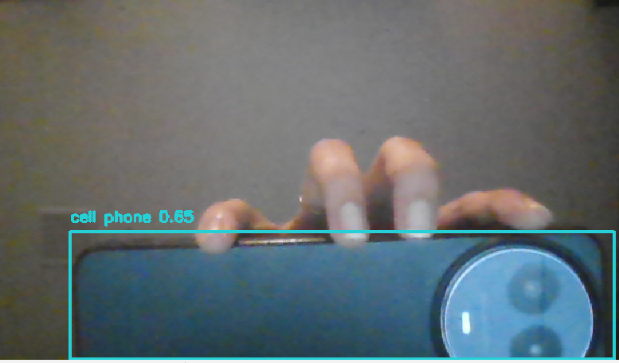
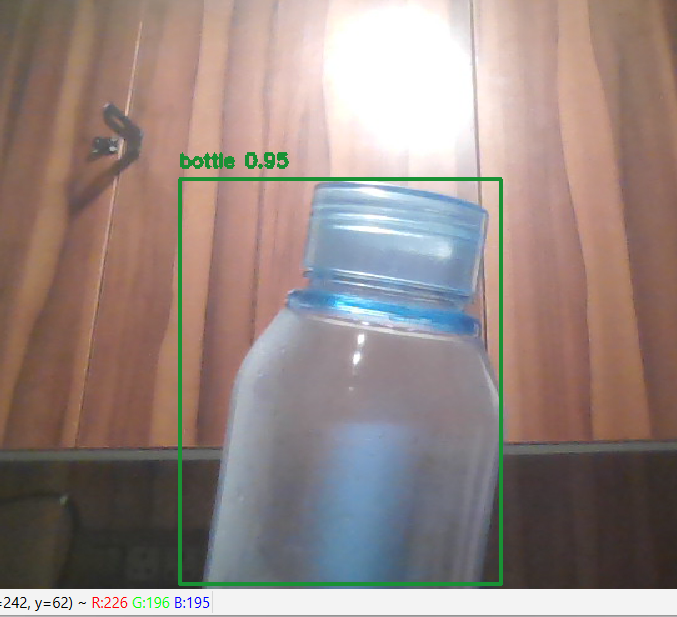

# Real-Time Object Detection using YOLO v4 through Laptop Camera
### Name : Starbiya S
### Reg no : 212223040208
## Aim

To perform real-time object detection using the YOLO v4 model through a laptop webcam using Python and OpenCV.


---

# Algorithm

1. Import required libraries.
2. Define URLs for YOLO v4 files.
3. Automatically download YOLO weights, configuration, and COCO class names.
4. Load the YOLO v4 model using OpenCV DNN.
5. Start webcam capture.
6. Convert each video frame into a blob.
7. Pass the blob into the YOLO network.
8. Detect objects and confidence scores.
9. Apply Non-Maximum Suppression (NMS) to remove overlapping boxes.
10. Draw bounding boxes and labels on detected objects.
11. Display the real-time output.
12. Press `q` to stop detection.

---

# Program

```python
import cv2
import numpy as np
import urllib.request
import os

# File URLs
weights_url = "https://github.com/AlexeyAB/darknet/releases/download/yolov4/yolov4.weights"
cfg_url = "https://raw.githubusercontent.com/AlexeyAB/darknet/master/cfg/yolov4.cfg"
names_url = "https://raw.githubusercontent.com/pjreddie/darknet/master/data/coco.names"

# File Names
weights_file = "yolov4.weights"
cfg_file = "yolov4.cfg"
names_file = "coco.names"

# Download Files Automatically
if not os.path.exists(weights_file):
    print("Downloading YOLOv4 weights...")
    urllib.request.urlretrieve(weights_url, weights_file)

if not os.path.exists(cfg_file):
    print("Downloading YOLOv4 config...")
    urllib.request.urlretrieve(cfg_url, cfg_file)

if not os.path.exists(names_file):
    print("Downloading COCO names...")
    urllib.request.urlretrieve(names_url, names_file)

print("All files ready!")

# Load YOLO Model
net = cv2.dnn.readNet(weights_file, cfg_file)

# Load COCO Class Names
with open(names_file, "r") as f:
    classes = [line.strip() for line in f.readlines()]

# Get Output Layers
layer_names = net.getLayerNames()
output_layers = [layer_names[i - 1] for i in net.getUnconnectedOutLayers()]

# Colors
colors = np.random.uniform(0, 255, size=(len(classes), 3))

# Start Webcam
cap = cv2.VideoCapture(0)

while True:
    ret, frame = cap.read()

    if not ret:
        break

    height, width, channels = frame.shape

    # Create Blob
    blob = cv2.dnn.blobFromImage(
        frame,
        1 / 255,
        (416, 416),
        swapRB=True,
        crop=False
    )

    net.setInput(blob)
    outputs = net.forward(output_layers)

    class_ids = []
    confidences = []
    boxes = []

    # Detect Objects
    for output in outputs:
        for detection in output:
            scores = detection[5:]
            class_id = np.argmax(scores)
            confidence = scores[class_id]

            if confidence > 0.5:
                center_x = int(detection[0] * width)
                center_y = int(detection[1] * height)

                w = int(detection[2] * width)
                h = int(detection[3] * height)

                x = int(center_x - w / 2)
                y = int(center_y - h / 2)

                boxes.append([x, y, w, h])
                confidences.append(float(confidence))
                class_ids.append(class_id)

    # Remove Overlapping Boxes
    indexes = cv2.dnn.NMSBoxes(boxes, confidences, 0.5, 0.4)

    # Draw Results
    for i in range(len(boxes)):
        if i in indexes:
            x, y, w, h = boxes[i]

            label = str(classes[class_ids[i]])
            confidence = confidences[i]
            color = colors[class_ids[i]]

            cv2.rectangle(frame, (x, y), (x + w, y + h), color, 2)

            cv2.putText(
                frame,
                f"{label} {confidence:.2f}",
                (x, y - 10),
                cv2.FONT_HERSHEY_SIMPLEX,
                0.5,
                color,
                2
            )

    # Show Frame
    cv2.imshow("YOLO v4 Object Detection", frame)

    # Press q to Quit
    if cv2.waitKey(1) & 0xFF == ord('q'):
        break

# Cleanup
cap.release()
cv2.destroyAllWindows()
```

---

# Output







---

# Result

Thus, real-time object detection using the YOLO v4 model through the laptop camera was successfully implemented using Python and OpenCV.

---